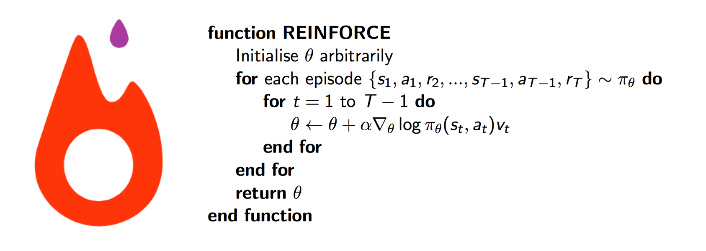

# PyTorch REINFORCE

 

PyTorch implementation of REINFORCE, supporting both **continuous** and **discrete** task.
This repo supports the environments in OpenAI gym. 

Contributions are welcome. If you know how to make it more stable, don't hesitate to send a pull request.

## Requirement
- python 2.7
- PyTorch
- OpenAI gym
- Mujoco (optional)


## Run
Use the default hyperparameters. (Program will detect whether the environment is continuous or discrete)

```
python main.py --env_name [name of environment]
```
