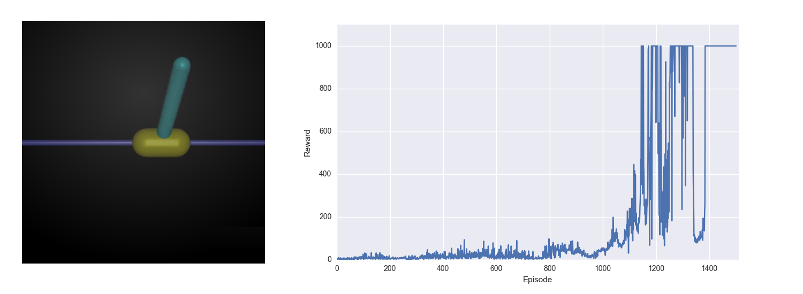
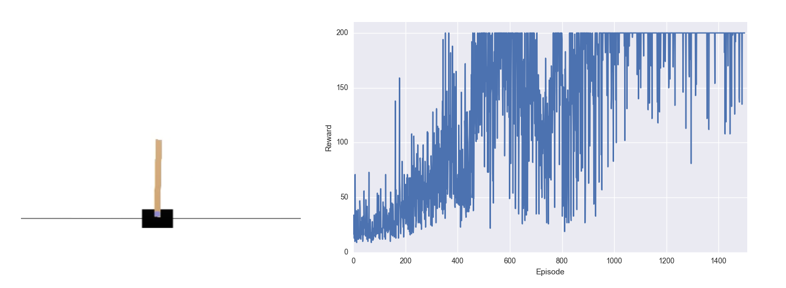

# PyTorch REINFORCE

 

PyTorch implementation of REINFORCE.     
This repo supports both **continuous** and **discrete** environments in OpenAI gym. 


## Requirement
- python 2.7
- PyTorch
- OpenAI gym
- Mujoco (optional)


## Run
Use the default hyperparameters. *(Program will detect whether the environment is continuous or discrete)*

```
python main.py --env_name [name of environment]
```

## Experiment results
### continuous: InvertedPendulum-v1



### discrete: CartPole-v0



## Reference
- [pytorch example](https://github.com/pytorch/examples/blob/master/reinforcement_learning/reinforce.py)
